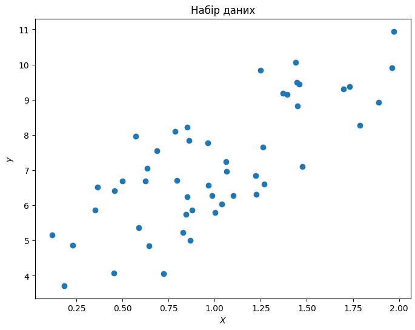
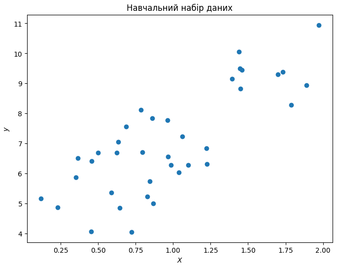
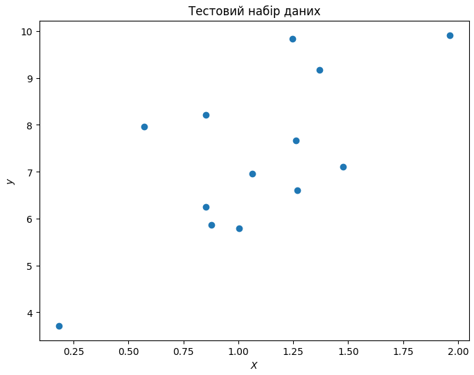
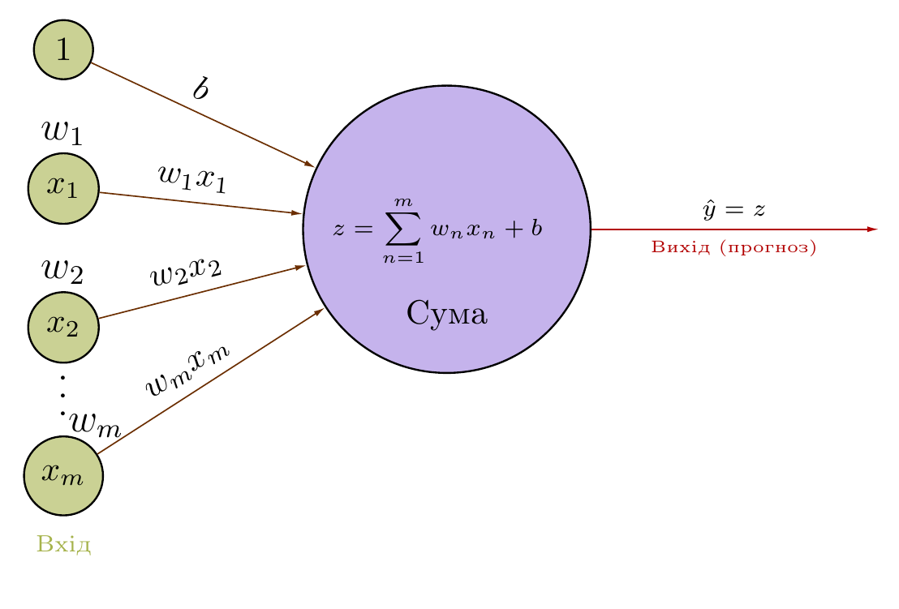
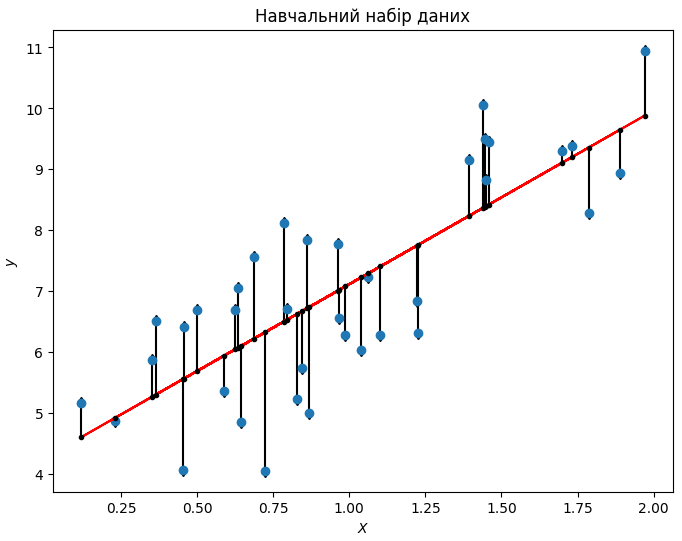

class: middle, center, title-slide 

# Системи штучного інтелекту

Лінійна регресія

  
Кочура Юрій Петрович 
[iuriy.kochura@gmail.com](mailto:iuriy.kochura@gmail.com)  
<a href="https://t.me/y_kochura">@y_kochura</a>  

---

class: blue-slide, middle, center
count: false

.larger-xx[Пайплайн]

---

class: middle 

1. .bold[Датасет]
1. .bold[Створення алгоритму машинного навчання] (лінійна регресія, логістична регресія, машина опорних векторів, нейронна мережа, ... )
1. .bold[Ініціалізація параметрів]
1. .bold[Вибір функції втрат та оптимізаційного алгоритму]
1. .bold[Повторити $n$ разів:]

  .smaller-x[
  5.1. Пропустити $k$ прикладів з датасету через алгоритм

  5.2. Обчислити цільову функцію (усереднене значення функції втрат для $k$ прикладів)

  5.3. Обчислити градієнти цільової функції відносно навчальних параметрів використовуючи правило ланцюжка

  5.4. Оновити навчальні параметри відповідно до правила оптимізаційного алгоритму]  

---

class: blue-slide, middle, center
count: false

.larger-xx[Датасет]

---

class: middle, center
# Датасет

.width-90[]

---

class: middle, center
# Навчальна вибірка

.width-90[]

---

class: middle, center
# Тестова (валідаційна) вибірка

.width-90[]

---

class: blue-slide, middle, center
count: false

.larger-xx[Алгоритм машинного навчання]

Лінійна регресія

---

class: middle, center

.width-90[]

Регресія спрямована на визначення зв’язків між (зазвичай неперервними) змінними.

Приклад: [Прогнозування цін на житло](https://towardsdatascience.com/predicting-house-prices-with-linear-regression-machine-learning-from-scratch-part-ii-47a0238aeac1)

???
Регресійна модель визначає зв’язок між незалежною змінною та залежною змінною за допомогою функції. Формулювання регресійного аналізу допомагає передбачити вплив незалежної змінної на залежну.

Ex: Прогнозування цін на будинки для продажу за допомогою лінійної регресії. Ми можемо побудувати таблицю, у якій кожен рядок відповідає окремому будинку, а кожен стовпець відповідає певному релевантному атрибуту, такому як площа будинку, кількість спалень, кількість ванних кімнат і кількість хвилин (хотьби пішки) до центру міста.

---

class: middle, center

# Лінійна регресія

.larger-x[$$\hat y =  \sum_{i=1}^m w_i x_i  + b$$]

.grid[
.kol-1-2[
.center.width-110[]
]

.kol-1-2[
.center.width-90[]
]
]

---

class: blue-slide, middle, center
count: false

.larger-xx[Ініціалізація параметрів]

---

class:  middle,

.center[Щоб почати процес навчання, потрібно ініціалізувати параметри моделі: 

ваги $ W$ та зсув $b$]

.larger-x[$$\hat y =  \sum_{i=1}^m w_i x_i  + b$$]

.larger-x[$$\hat y =  W \cdot X + b$$]

Ініціалізація може мати значний вплив на збіжність оптимізаційного алгоритму при навчанні моделі. Прості схеми ініціалізації можуть прискорити навчання, але вони вимагають певної обережності, щоб уникнути типових пасток (зникнення, вибух градієнтів, тощо)

---

class: blue-slide, middle, center
count: false

.larger-xx[Функція втрат]

---

class: middle

Функція втрат:
$$\mathcal{L^{(i)}}  = \Big(\hat{y}^{(i)} -  y^{(i)} \Big)^2$$ 

Цільова функція:
$$\begin{aligned}\mathcal{J}(\hat y,y)   &= \frac{1}{n} \sum\_{i=1}^n \mathcal{L^{(i)}} =\\\\
&= \frac{1}{n} \sum\_{i=1}^n \Big(\hat{y}^{(i)} -  y^{(i)} \Big)^2 = \\\\
&= \frac{1}{n} \sum\_{i=1}^n \Big(\Big(W \cdot X^{(i)} + b\Big) -   y^{(i)} \Big)^2 \end{aligned}$$ 

де $n$ &mdash; загальна кількість навчальних прикладів. 

---

class: middle

$$\mathcal{L^{(i)}}  = \Big(\hat{y}^{(i)} -  y^{(i)} \Big)^2$$ 

.center[
.width-80[]
]

---

class: blue-slide, middle, center
count: false

.larger-xx[Оптимізаційний алгоритм]

Одновимірний градієнтний спуск

---

class: middle

## Одновимірний градієнтний спуск
.smaller-x[

Розглянемо деяку неперервну диференційовану дійсну функцію $f: \mathbb{R} \rightarrow \mathbb{R}$. Розкладаючи у ряд Тейлора, ми отримуємо:

$$f(x + \varepsilon) = f(x) + \varepsilon f^{'}(x) + \mathcal{O}(\varepsilon^2)$$

Щоб усе було просто, давайте виберемо фіксований розмір кроку $\alpha > 0$ та оберемо $\varepsilon = -\alpha f^{'}(x)$. Підставляючи це у ряд Тейлора, отримаємо:

$$f(x -\alpha f^{'}(x)) = f(x) - \alpha f^{'2}(x)  + \mathcal{O}(\alpha^2 f^{'2}(x))$$

Якщо похідна $f^{'}(x) \neq 0$ не зникає ми робимо прогрес так як $\alpha f^{'2}(x) > 0$. Крім того, ми завжди можемо вибрати $\alpha$ досить малим, щоб вирази вищих порядків стали нерелевантними. Тому ми приходимо до

$$f(x -\alpha f^{'}(x)) \lessapprox f(x)$$

Це означає, якщо ми використовуємо

$$x \leftarrow x -\alpha f^{'}(x)$$

для ітерації по $x$, значення функції  $f(x)$  може зменшитись. 
]

???
Градієнтний спуск в одному вимірі є чудовим прикладом для пояснення того, чому алгоритм градієнтного спуску може зменшити значення цільової функції.

Ряд Тейлора використовується для опису того, як виглядає функція в околі деякої точки $x$.

Тобто в першому порядку наближення $f(x + \varepsilon)$ визначається значенням функції $f(x)$ і першою похідною $f^{'}(x)$ при $x$. Цілком логічно припустити, що для невеликих $\varepsilon$, що рухаються в напрямку негативного градієнта, буде зменшуватися $f$. 

Тому під час градієнтного спуску ми спочатку вибираємо початкове значення $x$ і константу $\alpha > 0$, а потім використовуємо їх для безперервної ітерації $x$ до досягнення умови зупинки, наприклад, коли величина градієнта $ |f^{'}(x)|$ достатньо малий або кількість ітерацій досягла певного значення.

---

class: middle

.center[
.width-80[]
]

???

Для простоти ми вибираємо цільову функцію $f(x) = x^2$, щоб проілюструвати, як реалізувати градієнтний спуск. Хоча ми знаємо, що $x = 0$ є рішенням для мінімізації $f(x)$, ми все ще використовуємо цю просту функцію, щоб спостерігати, як змінюється $x$.

---

class: middle

Хід оптимізації за параметром $x$ 

.center[
.width-80[]
]

---

class: middle

Хід оптимізації за параметром $x$ 

.center[
.width-80[]
]

???
Якщо ми використовуємо надто низьку швидкість навчання, $x$ оновлюватиметься дуже повільно, що потребуватиме більше ітерацій, щоб отримати краще рішення.

---

lass: middle

Хід оптимізації за параметром $x$ 

.center[
.width-80[]
]

???
якщо ми використовуємо надмірно високу швидкість навчання, $|\alpha f^{'}(x)|$ може бути занадто великим для формули розкладання Тейлора першого порядку. Тобто термін $\mathcal{O}(\alpha^2 f^{'2}(x))$ може стати значущим. У цьому випадку ми не можемо гарантувати, що ітерація $x$ зможе знизити значення $f(x)$.

---

class: middle
# Градієнт
.larger-x[
$$
\nabla f(\left.x\_{1}, x\_{2}, \ldots, x\_{n}\right)=\left[\begin{aligned}\begin{array}{c}\dfrac{\partial f}{\partial x\_1}(\left.x\_{1}, x\_{2}, \ldots, x\_{n}\right)\\\\[18pt]
\dfrac{\partial f}{\partial x\_2}(\left.x\_{1}, x\_{2}, \ldots, x\_{n}\right)\\\\[18pt]
\vdots \\\\
\dfrac{\partial f}{\partial x\_n}(\left.x\_{1}, x\_{2}, \ldots, x\_{n}\right)
\end{array}\end{aligned}\right]
$$
]

---

class: middle

$$\begin{aligned}\hat y &= W \cdot X + b \\\\
J(\hat y,y)  &= \frac{1}{n} \sum_{i=1}^n \Big(\hat{y}^{(i)} -  y^{(i)} \Big)^2
\end{aligned}$$

$$\boxed{\begin{aligned}
\frac{\partial J(\hat y, y)}{\partial \hat y} &= \frac{2}{n} \sum\_{i=1}^n \Big(\hat{y}^{(i)} -  y^{(i)} \Big)   \\\\[12pt]
\frac{\partial J(\hat y, y)}{\partial W } = \frac{\partial J(\hat y, y)}{\partial \hat y} \frac{\partial \hat y}{\partial W }  &= \frac{2}{n} \sum\_{i=1}^n \Big(\hat{y}^{(i)} -  y^{(i)} \Big) X^{(i)}   \\\\[12pt]
\frac{\partial J(\hat y, y)}{\partial b} =  \frac{\partial J(\hat y, y)}{\partial \hat y} \frac{\partial \hat y}{\partial b }&=  \frac{2}{n} \sum\_{i=1}^n \Big(\hat{y}^{(i)} -  y^{(i)} \Big)
\end{aligned}}$$

.larger-x[
$$
\begin{aligned}
\nabla J(\left.W, b\right) =  \left[\begin{array}{c}\dfrac{\partial J}{\partial W}\\\\[18pt]
\dfrac{\partial J}{\partial b}
\end{array}\right] 
&=  \left[\begin{array}{c}\frac{2}{n} \sum\_{i=1}^n \Big(\hat{y}^{(i)} -  y^{(i)} \Big) X^{(i)} \\\\[18pt]
\frac{2}{n} \sum\_{i=1}^n \Big(\hat{y}^{(i)} -  y^{(i)} \Big) 
\end{array}\right]
\end{aligned}
$$
]

---

class: middle

# Оновити ваги та зсув моделі
.larger-xx[
$$\begin{aligned}
W &= W - \alpha \frac{\partial J}{\partial W} \\\\[15pt]
b &= b - \alpha \frac{\partial J}{\partial b}
\end{aligned}$$
]

---

class: end-slide, center
count: false

.larger-xx[Кінець] 