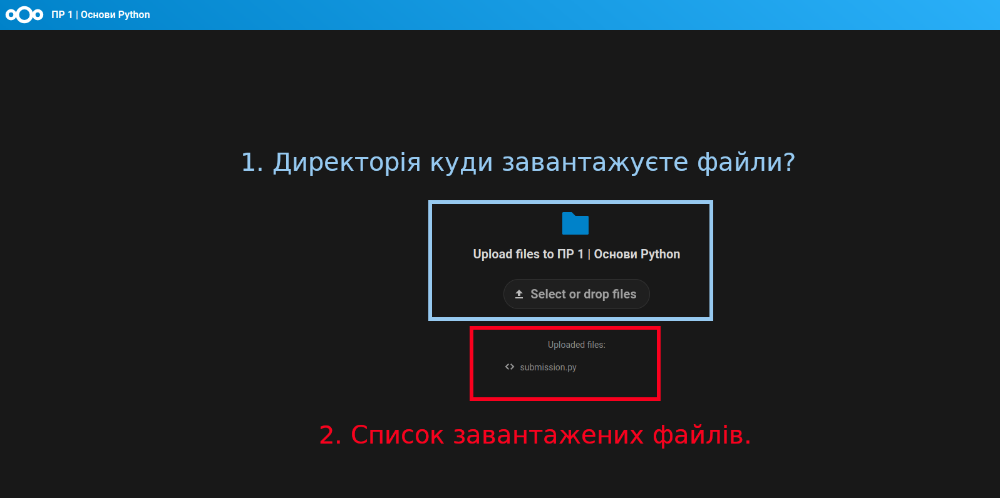

 # Питання-відповіді

- А як можна перевірити що файл з кодом дійсно завантажився до Вас у cloud?
> 
> Назва директорії, куди плануєте завантажувати файли та перелік щойно завантажених файлів відображається на екрані.

- Чи можна використовувати допоміжні бібліотеки та функції під час вирішення завдання?
> Так, можна.

- Коли можна очікувати на результати перевірки?
> Перші результати оцінювання будуть повідомлені на занятті з комп'ютерного практикуму після дедлайну.

- Якщо раптом будуть знайдені недоліки в коді, або шматки які можна покращити, чи можна буде додатково допрацювати код?
> Так, можна, але уже на перездачі. Для виконання завння Вам надано тести, які дають можливість виявити недоліки в коді та перевірити його працездатність.